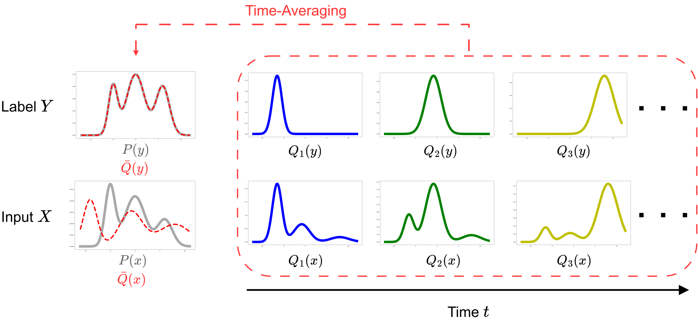

# Replay Stabilized SSA (RS-SSA)
## Abstract
While deep regression models exhibit strong generalization, their performance often suffers in real-world deployment due to distribution shifts. Test-Time Adaptation (TTA) addresses this by adapting models using unlabeled test data during inference. Recently, Subspace Statistical Alignment (SSA) has emerged as a promising TTA method for regression, aligning features within a predictioncritical low-dimensional subspace. However, applied to non-stationary data streams, SSA struggles when label distributions shift or become locally biased; these fluctuations distort the estimated statistics, leading to unstable updates and performance degradation. To overcome this, we extend SSA with a Reservoir-Sampling-based replay buffer, an exponential moving average (EMA) of the alignment statistics to suppress statistical distortion, and Weight Ensemble to stabilize adaptation. These components work synergistically to stabilize adaptation against non-stationary label distributions.



## TTA実行の流れ

以下では再実行手順を説明します．  

### 1. 依存関係のインストール
```bash
uv sync
```

仮想環境を有効化して実行する場合は，先に以下を実行してください．
```bash
source .venv/bin/activate
```

有効化後は `python` で実行できます．  
有効化しない場合は `.venv` の Python を明示して実行してください（例: `./.venv/bin/python`）．

### 2. `imagenet_c` の互換修正（必要な場合のみ）
`skimage` のバージョン差異で `multichannel` エラーが出る環境では，次を修正します．

- 対象: `.venv/lib/python3.12/site-packages/imagenet_c/corruptions.py`
- 置換: `multichannel` -> `channel_axis`

### 3. データセットの配置
- UTKFace: <https://www.kaggle.com/datasets/moritzm00/utkface-cropped>
- 4Seasons: 本リポジトリでは，RobustLoc で案内されているリサイズ済みデータを使用します．  
  RobustLoc: <https://github.com/sijieaaa/RobustLoc>  
  Download: <https://drive.google.com/file/d/1H2ujRAd1v3reg31zDHoM1yBI0IUi1Ovz/view?usp=sharing>

取得したデータは，`data/` 配下の既存ディレクトリ構成に合わせて配置してください．

### 4. Sourceモデルの学習（重み作成）
`train_source.py` を `configs/train_source/` の設定で実行します．
```bash
python train_source.py -c configs/train_source/utkface-Res50-GN.yaml -o outputs/source
```

学習した重みは `models/weights/<dataset>/` に保存されます．

### 5. Source特徴量と統計量（主成分）を作成
`feature_stats.py` を実行して，特徴統計（`mean`, `basis`, `eigvals`）と Source特徴量を保存します．
```bash
python feature_stats.py \
  -c configs/valid_feature_stats/utkface-Res50-GN.yaml \
  -o models \
  --save_feature
```

- 統計量: `models/stats/<dataset>/...`
- Source特徴量: `models/train_features/<dataset>/...`

### 6. TTA実行
`main.py` を `configs/tta/` の設定で実行します．
```bash
python main.py \
  -c configs/tta/utkface/utkface-non_iid-Res50-GN-rs_ssa-Lv5.yaml \
  -o outputs/run_tta \
  --seed 42
```

結果は `outputs/run_tta/.../seed42/` 配下に保存されます（`config.yaml`, `metrics.json` など）．
